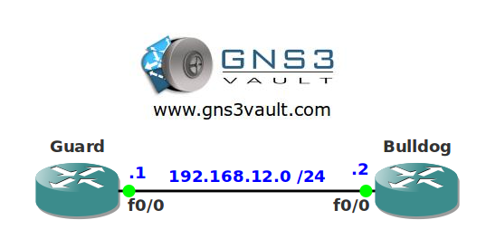

# IOS Login Enhancements

## Scenario

You are the security office for the national security team in the Netherlands. One of your colleagues demonstrated you how to perform a dictionary attack on the VTY of one of your routers. You read about the different IOS login enhancements and decide to protect your network a little bit more.

## Goals

- All IP addresses have been preconfigured for you.
- Configure OSPF for full connectivity.
- Configure router Bulldog so it will block all access to the VTY for 50 seconds when there are three failed attempts within 20 seconds. This should not apply for traffic that is sourced from the loopback0 interface on router Guard.
- Configure router Bulldog so all successful logins are logged.
- Configure router Bulldog so there is a delay between login attempts of 5 seconds.

## IOS

c3640-jk9s-mz.124-16.bin

## Topology

## Video Solution

[Video Link](http://www.youtube.com/watch?v=9RhVbvwq3I4)
