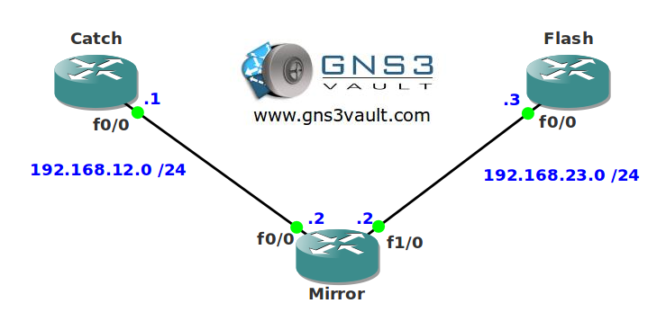

# IP Fragment Filtering

## Scenario

As part of the security team you are always looking for ways to improve security within the company. You heard bad things about fragmented IP packets being a security risk to your network. You decide to block them using an access-list.

## Goal

- All IP addresses have been configured for you, look at the topology picture for the IP addresses.
- OSPF has been preconfigured for you.
- Configure router Mirror so IP fragments from network 1.1.1.0 /24 are not allowed to reach router Flash.

## Topology

## Video Solution

http://www.youtube.com/watch?v=OmtJswXGAHs
