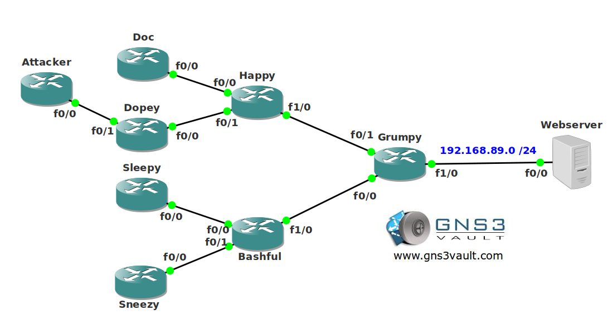

# IP Source Tracker

## Scenario

You are the security office for the national security team in the Netherlands. It seems your webserver is under attack but you are unsure where the attacker is located. You want to use a method to track down the source IP address from the attacker.

## Goals

* All IP addresses have been preconfigure for you.
* EIGRP has been configured for connectivity.
* Start a ping from the attacker to the webserver.
* Use the "source track" command to track down the attacker in your network.
* Send syslog messages every 2 minutes.

## IOS

c3725-adventerprisek9_ivs-mz.124-15.T13

## Topology

## Video Solution

[Watch on YouTube](http://www.youtube.com/watch?v=mvArYqcwpiI)
