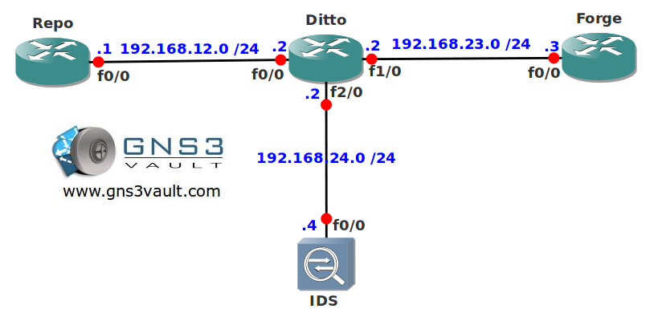

# IP Traffic Export

## Scenario

You work for a local copyshop in a small town in the USA. To improve network security you have installed a new Intrusion Detection System (IDS) but right now it's only receiving traffic from router Ditto. You are familiar with SPAN for switches but you don't know how to export traffic on routers...let's see if there's a copycat in you!

## Goals

- All IP addresses have been preconfigure for you.
- EIGRP has been configured for connectivity.
- Configure router Ditto so all EIGRP and HTTP traffic is exported to router IDS.

## IOS

c3640-jk9s-mz.124-16.bin

## Topology

## Video Solution

[Video Solution on YouTube](http://www.youtube.com/watch?v=K-kBptdFEEs)
