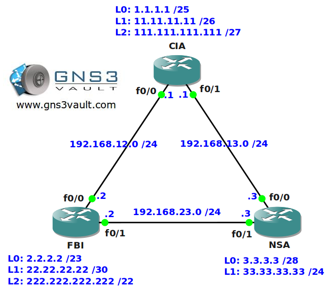

# Named Access-List

## Scenario

After configuring standard and extended access-lists for the agents of three well-known agencies you were promoted to junior security operator. It's now time to upgrade your skills and show them how to implement named access-lists.

## Goal

- All IP addresses have been configured for you, look at the topology picture for the IP addresses.
- OSPF has been configured for full connectivity.
- All routers are running services like HTTP, HTTPS, TELNET and SSH.
- Make sure you use the most specific wildcard for all your access-lists.
- You are not allowed to use numbered access-lists, only named access-lists.
- Configure the network so users from router NSA's L1 interface are not allowed to reach the HTTPS server on router CIA's L2 interface.
- Configure the network so nobody is allowed to reach HTTP servers on router NSA except the L2 interface on router FBI.
- Configure the network so users from router NSA's L0 interface are allowed to reach the HTTPS server on router CIA's L2 interface.
- Configure the network so users from router CIA's L2 interface are not allowed to SSH into router FBI's 222.222.222.222 IP address.

## Topology

## Video Solution

[Video Solution on YouTube](http://www.youtube.com/watch?v=hnrcI_ebk3I)
