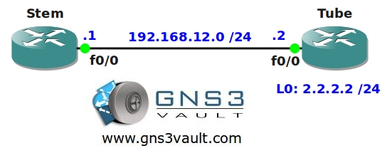

# Time Based Access-List

## Scenario

As the owner of a large swiss watch company you would like to make sure your employees are unable to browse the Internet during working hours. Time is money so it's time to find a solution...

## Goal

* All IP addresses have been configured for you, look at the topology picture for the IP addresses.
* OSPF has been configured for full connectivity.
* Configure router Tube so users are unable to access the HTTP server on weekdays between 9:00 - 17:00.

## Topology

## Video Solution

[YouTube Video Solution](http://www.youtube.com/watch?v=MHZ5Mh9nzM8)
