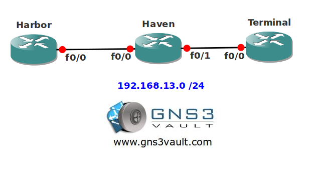

# Transparent IOS Firewall

## Scenario

You are part of the security team for the Rotterdam Harbor located in The Netherlands. One of your firewalls has crashed and due to decreased IT budgets you don't have any spare firewalls around. You do have a spare router that you could use so you decide to turn it into a transparent firewall. Hopefully everything will be OK and your boss doesn't send you to null0...

## Goal

- All IP addresses have been configured for you.
- Configure router Haven as a transparent firewall. You will need the bridge function to achieve this.
- Use network 192.168.13.0 /24 so router Harbor and Terminal are in the same subnet.
- Ensure router Harbor can reach router Terminal by using TELNET or HTTP, all other traffic should be dropped.
- Ensure router Harbor and Terminal are unable to communicate using IPv6.

## IOS

*c3725-adventerprisek9-mz.124-15.T7.bin*

## Topology

## Video Solution

http://www.youtube.com/watch?v=KeFPJInD3TQ
