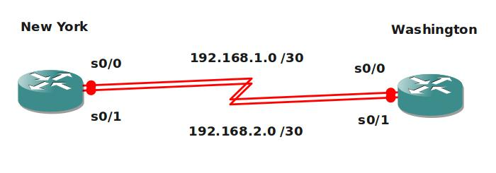

# Static Routing Beginners Lab

## Scenario

You are working as a networking specialist at a company called "Networks4All". One of their customers has 2 dedicated links to connect their New York site to the Washington site. You are not allowed to use routing protocols because they are paying for every single bit that's sent on these links. You need to do use static routing to get the job done and keep the customer happy.

## Goal

* All IP addresses are preconfigured as shown in the topology picture.
* There is a Loopback0 interface on the Washington router: IP Address 2.2.2.2/30.
* There is a Loopback0 interface on the New York router: IP Address 1.1.1.1/30.
* New York: create a static route pointing to the Loopback0 network on Washington, traffic should pass the 192.168.1.0 network.
* Washington: create a default route pointing to the Loopback0 network on New York, traffic should pass the 192.168.2.0 network. In the routing table you should see a 0.0.0.0 entry.
* New York: create a backup static route pointing to the Loopback0 network on Washington, administrative distance should be 100.
* Washington: change the default route so it stays in the routing table even when the interface goes down.

## IOS

* c3640-jk9s-mz.124-16.bin

## Topology

## Video Solution

[Video Tutorial](http://www.youtube.com/watch?v=XQcF8yMIwkw)
