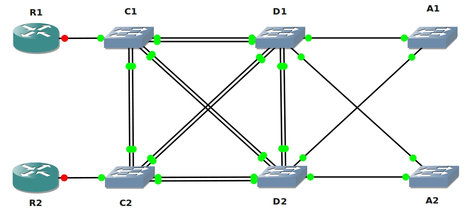

# CCNP Switch Lab

## Scenario:

**For this lab you need REAL hardware. You can't use switches in GNS3!**

**Minimum Equipment needed: (Or use rack rentals...)**

- Core Switches: Cisco 3560 or Cisco 3550 (3550 can't do Private Vlan)
- Distribution Switches: Cisco 3560 or Cisco 3550 (doesn't matter which one) perhaps a 2950 could do.
- Access Layer: Cisco 2950
- Clients: PC or router connected to the access switches, this is optional however.

You never liked hierarchy and so routing isn't your way to go....who needs a subnet mask anyway!? Switching is what you love and that's why you became the senior network engineer responsible for all of the switches in the Hotel you work for. Multiple users are depending on you to keep the network running so you need to know what to do. You decide to get some new switches and start your configuration!

## Goal:

- This topology is very similar to what you will find in the CCNP SWITCH material.
- C1 and C2 are the Core layer switches.
- D1 and D2 are the Distribution layer switches.
- A1 and A2 are the Access layer switches.
- Delete all configurations from your switches, don't forget the vlan database by typing in "del flash:vlan.dat".
- All links between switches with the following exceptions:
  - Do not form a trunk between C1 and D1.
  - Use a Cisco Protocol to form a trunk between D1 and A1.
  - The link between D1 and A2 should use a dynamic mode to form a trunk.
  - The link between C1 and D1 should never negotiate to form a trunk, setting the port to 'access' mode is not the answer to this question.
- All redundant links should be bundled in a portchannel.
- Use a standard-based protocol for the portchannel between C1 and C2.
- C1 should start the portchannel negotiation.
- C2 should only form a portchannel when C1 requests it.
- Configure the port channel between C2 and D2 to use a Cisco protocol.
- Configure the port channel between C2 and D2 never to use negotiation.
- C1 should be able to create all new vlans, the domainname should be VAULT.
- All other switches only need to synchronize to the latest vlan information, they are not able to create/modify/delete vlans.
- D2 should be configured so it does not sync with the latest vlan information but forwards advertisements to other switches.
- Create vlan 10, 20, 30, 40, 50 and 500.
- Take 2 ports on A1 with nothing connected to it. These ports will be used in the future for clients...make sure that any client connected to these ports are unable to communicate with each other. They should be able to communicate with any other port on the switch.
- To enhance security R1 and R2 should only be able to communicate with each other and interface fax/x (pick an interface with nothing connected to it). The routers should be in vlan 50 and you are allowed to use vlan 500 for your configuration.
- There have been complaints about the convergence time of your network. Choose another STP protocol which has a better convergence time and creates a spanning-tree instance per vlan.
- C1 should be the root bridge for vlan 10, C2 should be the backup.
- C2 should be the root bridge for vlan 20, C1 should be the backup.
- Your security officer comes to you and has some requests...
- BPDU packets coming from one of the client interfaces on A1 should be filtered, when it receives a BPDU it should be filtered.
- BPDU packets coming from one of the client interfaces on A2 should be error disabled when you receive a BPDU.
- D2 will be used as a default gateway for the clients on vlan 10. Use the IP addres 10.10.10.10 for the default gateway address.
- The link between C1 and C2 should become a routed port. Change the portchannel so it's a layer3 link instead of layer2. You can use the 192.168.12.0 / 30 subnet. C1 can use .1 and C2 can use .2
- Create a VACL (Vlan access-list) on D2 so IPv6 traffic will be dropped in vlan 30.
- There is a (fictional) DHCP server behind R1. Make sure you protect vlan 20 on A2 from fake DHCP replies.
- There have been reports of ARP poisoning, configure A2 so invalid ARP-replies are blocked.
- Configure A1 on interface Fx/x (pick any interface with nothing or a client connected to it) so it only allows 2 mac addresses. The port should not be error-disabled but you should see the counter increase when mac address number 3 shows up. Mac addresses should be learned dynamically.
- Configure D2 so A1 and A2 can never become the root bridge. Test this by setting the priority to a lower value on A1 or A2.
- Configure A2 so port fax/x (pick an interface with nothing connected to it) skips all STP states and goes to forwarding immediately.

## IOS:

Basic IOS for the switches should be sufficient. No special features needed.

## Topology:
