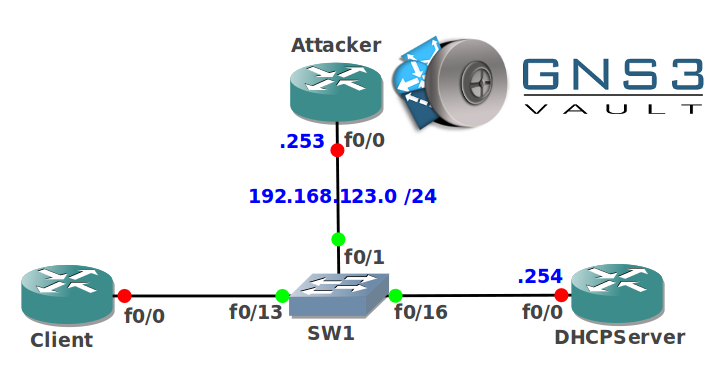

# DHCP Snooping

## Scenario:

**For this lab you need REAL hardware. You can't use switches in GNS3!**

**You need at least a Cisco Catalyst 3550 switch for this lab.**

One of your customers is being plagued by attacks on their switched infrastructure. You as a specialized switch specialist are looking for a method to counter DHCP spoofing attacks. Let's see what you can do for them...

## Goal:

* Configure the IP addresses on router Attacker and DHCP as specified in the topology picture.
* Configure DHCP server on router DHCP so it can serve the client an IP address.
* Configure DHCP snooping globally on SW1.
* Configure SW1 to use the correct trusted and untrusted interfaces.
* Configure SW1 so the client is limited to 10 DHCP packets per second.
* Configure router Attacker as a DHCP server to verify your DHCP snooping configuration.

## IOS:

Basic IOS for the switches should be sufficient. No special features needed.

## Topology:

## Video Solution:

http://www.youtube.com/watch?v=Mv9HsviLzdk&
