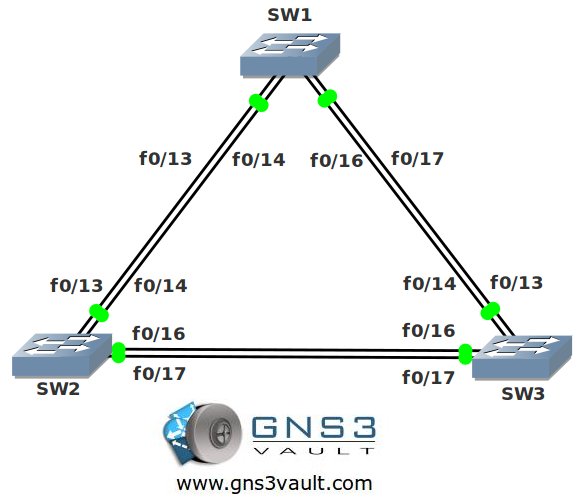

# MST (Multiple Spanning Tree)

## Scenario:

**For this lab you need REAL hardware. You can't use switches in GNS3!**

**You need at least Catalyst 2950 switches for this lab.**

You are a master of spanning tree and specialized in migration scenarios. Corkscrew inc. is one of your customers and they are having issues with their switches. There are many VLANs in the network and you would like to reduce the number of spanning tree calculations. As a result you decide to implement MST (Multiple Spanning Tree) for them.

## Goal:

* Configure all switches to use MST.
* Configure VLAN 10,20,30,40,50 and 60 on all switches.
* Configure VLAN 10,20 and 30 to use instance 1 for the spanning tree calculation.
* Configure VLAN 40,50 and 60 to use instance 2 for the spanning tree calculation.
* Configure SW1 to be the root bridge for the CIST.
* Configure SW2 to be the root bridge for instance 2.

## IOS:

Basic IOS for the switches should be sufficient. No special features needed.

## Topology:

## Video Solution:

http://www.youtube.com/watch?v=LVN_43nzYF0
