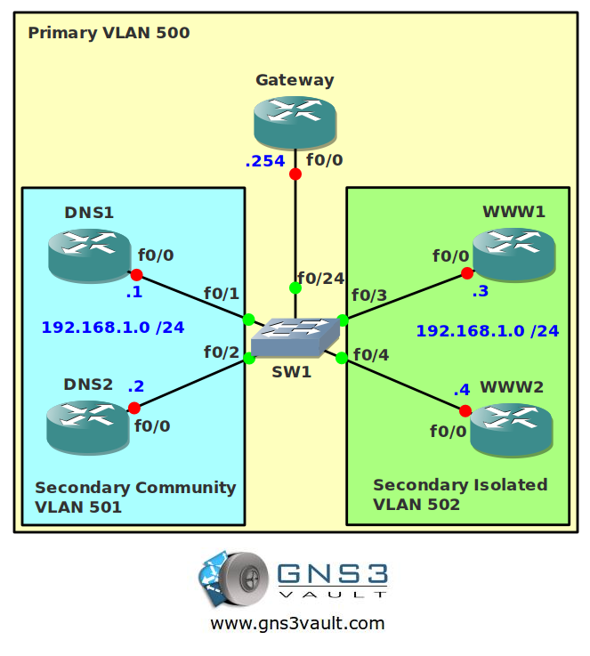

# Private VLAN

## Scenario:

**For this lab you need REAL hardware. You can't use switches in GNS3!**

**You need at least a Cisco Catalyst 3560 switch for this lab.**

You are the senior network engineer of a small company specialized in switching solutions. The datacenter houses a couple of servers and you would like to increase security. You prefer to keep all servers within the same subnet and prevent the usage of access-lists. It sounds like Private VLANs could help you out...

## Goal:

* Configure all IP addresses as specified in the topology picture.
* Configure VLAN 500 to be the primary VLAN.
* Configure VLAN 501 as a secondary community VLAN.
* Configure VLAN 502 as a secondary isolated VLAN.
* Configure the correct mapping between the primary and secondary VLANs.
* Configure DNS1 and DNS2 to be in the secondary community VLAN 501.
* Configure WWW1 and WWW2 to be in the secondary isolated VLAN 502.
* Configure fa0/24 on SwitchA as the promiscious port.
* DNS1 and DNS2 should be able to communicate with each other and the Gateway.
* WWW1 and WWW2 should only be able to communicate with the Gateway.

## IOS:

Basic IOS for the switch should be sufficient. No special features needed.

## Topology:

## Video Solution:

[YouTube Video: Private VLAN Configuration](http://www.youtube.com/watch?v=UYA7PQjNpls&)
