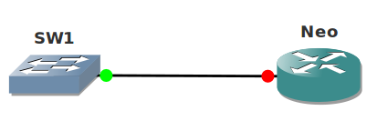

# Spanning Tree BPDU Filter

## Scenario

**_For this lab you need REAL hardware. You can't use switches in GNS3!_**

**_You need at least Catalyst 2950 switches for this lab._**

You are working as the network engineer at a school located in Germany. The network has been having issues last month after students took a CCNA class. You want to make sure the access layer of the network is more secure. When students try to mess with spanning-tree it should block the interface they are connected to.

## Goal

- Configure SW1 so it does not send any BPDUs towards router Neo. Any BPDU that you receive from router Neo should be ignored.

## Note

## IOS

Basic IOS for the switches should be sufficient. No special features needed.

## Topology

## Video Solution

http://www.youtube.com/watch?v=Drz6i_wZWTs
