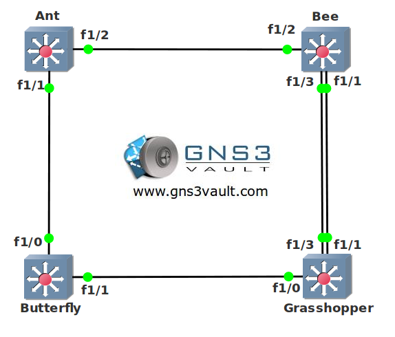

# Spanning Tree for CCNA

## Scenario

You are the leading network engineer of an international reptile and insects museum. Recently the museum has been experiencing trouble with their switched network due to loops. Up to you to optimize the spanning tree configuration!

## Goal

- Create VLAN 10, 20, 30 and 40 on all switches.
- Who is the root bridge for VLAN 10 and why?
- Make sure switch Ant is the root bridge for VLAN 10, switch Bee should be the backup in case switch Ant fails. You are not allowed to use the priority command.
- Make sure switch Bee is the root bridge for VLAN 20, switch Ant should be the backup in case switch Bee fails. You are not allowed to use the priority command.
- Make sure switch Butterfly is the root bridge for VLAN 30, switch Grasshopper should be the backup in case switch Butterfly fails. You are not allowed to use the spanning-tree root command.
- Make sure switch Grasshopper is the root bridge for VLAN 40, switch Butterfly should be the backup in case switch Butterfly fails. You are not allowed to use the spanning-tree root command.
- Change the hello timer on all switches for VLAN 10 to 4 seconds.
- Make sure switch Grasshopper does not use FastEthernet 1/1 to reach the root bridge in VLAN 10, you are not allowed to shutdown the interfaces.
- Make sure switch Grasshopper uses FastEthernet 1/3 to reach the root bridge in VLAN 20.
- In the future there will be a workstation connected to switch Bee's FastEthernet f1/4. Make sure it goes to forwarding mode immediately.

---

## IOS

- c3725-adventerprisek9-mz.124-15.T7.bin

## Topology

## Video Solution

http://www.youtube.com/watch?v=QmR8ELpNUIw
