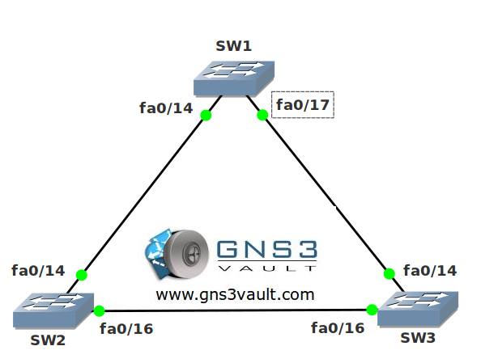

# Spanning Tree Loop Guard

## Scenario:

**For this lab you need REAL hardware. You can't use switches in GNS3!**

**You need at least Catalyst 2950 switches for this lab.**

The network agency corporation has hired you as a spanning tree specialist. One of their customers has issues with a switched network that only has fiber connections. Every now and then there's a problem with the fiber and as a result layer 2 loops occur. It will take two months for the fiber company to check all cables/connectors so you want a temporary solution...

## Goal:

- Configure SW1 so it is the root bridge for VLAN 1.
- Configure your spanning-tree topology so the fa0/16 interface on SW3 becomes an alternate port.
- Configure the fa0/16 interface on SW2 so it does not send or receive any BPDUs. This will cause a loop.
- Configure all switches so this loop will be detected and SW3 will shut its fa0/16 interface.

## IOS:

Basic IOS for the switches should be sufficient. No special features needed.

## Topology:

## Video Solution:

http://www.youtube.com/watch?v=Do42S-_w8KU&
