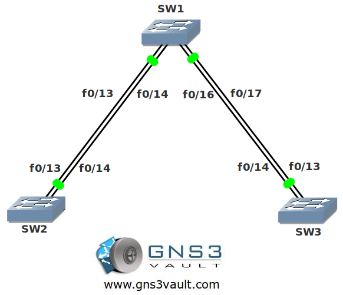

# Spanning Tree Root Guard

## Scenario

**For this lab you need REAL hardware. You can't use switches in GNS3!**

**You need at least Catalyst 2950 switches for this lab.**

Medieval corporation is specialized in enhancing security for switched networks. You as one of the network engineers in the security team are working on a switched network of one of your customers. You want to enhance security by making sure the network will not accept any inferior root bridges.

## Goal

- Configure SW2 as the root bridge for VLAN 1.
- Configure SW3 to have a spanning tree priority of 4096 for VLAN 1.
- Ensure SW1 does not accept SW3 as a root bridge.

## IOS

Basic IOS for the switches should be sufficient. No special features needed.

## Topology

## Video Solution

[Spanning Tree Root Guard Video](http://www.youtube.com/watch?v=dXGkJPw9xms)
