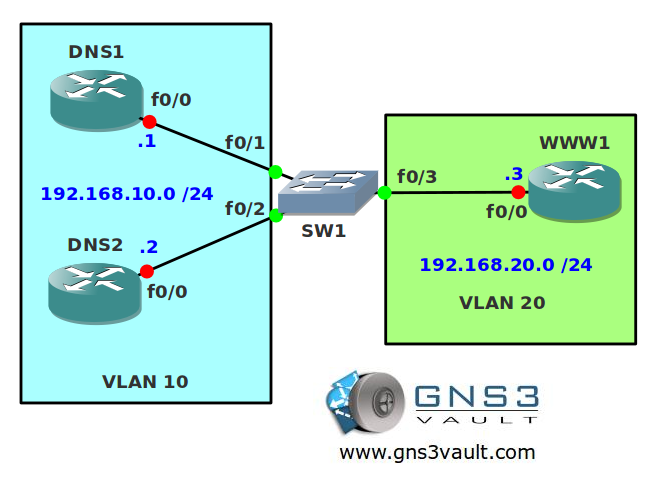

# Switch SVI Interface and Routing

## Scenario

**For this lab you need REAL hardware. You can't use switches in GNS3!**

**You need at least a Cisco Catalyst 3550 switch for this lab.**

The network agency corporation has hired you as a spanning tree specialist. One of their customers has issues with a switched network that only has fiber connections. Every now and then there's a problem with the fiber and as a result layer 2 loops occur. It will take two months for the fiber company to check all cables/connectors so you want a temporary solution...

## Goal

* Configure all IP addresses as specified in the topology picture.
* Configure SW1 so it builds a routing table.
* Configure SW1 so router DNS1 and DNS2 are in VLAN 10.
* Configure the fa0/3 interface on SW1 as a routed port.
* Ensure all routers are able to communicate with each other.

## IOS

Basic IOS for the switches should be sufficient. No special features needed.

## Topology

## Video Solution

[Video Solution on YouTube](http://www.youtube.com/watch?v=AB5Gr4vTmPw)
