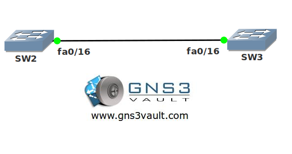

# UDLD (UniDirectional Link Detection)

## Scenario:

**For this lab you need REAL hardware. You can't use switches in GNS3!**

**You need at least Catalyst 2950 switches for this lab.**

Fiber 'r' us is specialized in fiber solutions for layer 2 switches. They are concerned that layer 2 loops might occur when the transmit or receive connectors of their fiber links get disconnected. You want to implement a feature that will prevent a loop in case this happens. You don't want to use a spanning tree solution so there's something else you'll have to configure...

## Goal:

* Configure UDLD on interface fa0/16 of both switches, use aggressive mode.
* Configure a MAC filter on SW2 that filters MAC address 0100.0ccc.cccc to simulate a link failure.

## IOS:

Basic IOS for the switches should be sufficient. No special features needed.

## Topology:

## Video Solution:

http://www.youtube.com/watch?v=GWBWMaRS47A
