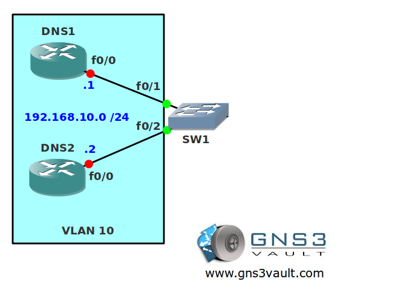

# VACL (VLAN Access List)

## Scenario

**_For this lab you need REAL hardware. You can't use switches in GNS3!_**

**_You need at least a Cisco Catalyst 3550 switch for this lab._**

The network agency corporation has security issues with their network. They are familiar with the configuration of access-lists but they have no idea how to filter traffic within a VLAN. You are familiar with Cisco catalyst switches so you decide to help them out to configure some VLAN access-lists (VACL).

## Goal

* Configure all IP addresses as specified in the topology picture.
* Configure SW1 so router DNS1 and DNS2 are unable to ping each other. Other traffic should be allowed.
* The interfaces on SW1 have to be layer 2 switchports.

## Additional Information

## IOS

Basic IOS for the switches should be sufficient. No special features needed.

## Topology

## Video Solution

[Video: VACL Configuration](http://www.youtube.com/watch?v=Ji4Hod7m_5U)
