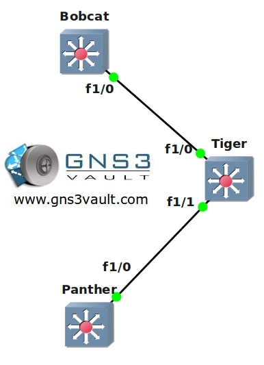

# VTP - Vlan Trunking Protocol

## Scenario

**For this lab you need REAL hardware. You can't use switches in GNS3! You only need layer 2 switches for this lab. The Cisco Catalyst 2950 or higher will work.**

You are working as a trainee at a large African safari company and acquired the task of setting up VTP (Vlan Trunking Protocol). You need to create a bunch of VLANS and it would be a shame if you had to do everything by hand, let's see if you can find a faster and more scalable solution.

## Goals

- Create the following VLANS on switch Bobcat:
  - VLAN 10: name Tigers
  - VLAN 20: name Lions
  - VLAN 30: name Panthers
- Configure the interfaces between the switches as trunks.
- Configure switch Bobcat to be the VTP server.
- Configure switch Panther to be a VTP client.
- Configure switch Tiger so it does not synchronise itself to the latest VTP information, it should forward advertisements to switch Panther though.
- Change the VTP domain name to "GNS3Vault".
- Use the password "Vault" for VTP.
- Make sure there is no unnecessary vlan traffic flooded on the trunk links.

## IOS

c3725-adventerprisek9-mz.124-15.T7.bin

## Topology

## Video Solution

http://www.youtube.com/watch?v=NFgqDU0-3hc
