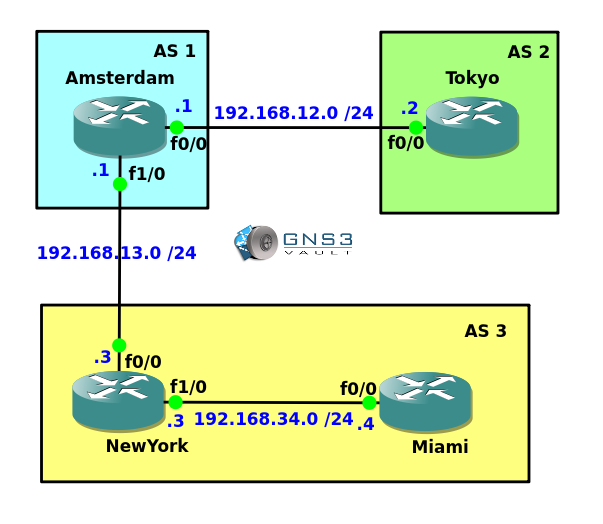

# BGP Neighbor Troubleshooting

## Scenario:

As the network engineer for a large corporation you are responsible for the configuration of BGP. One of your colleagues tried to install some new routers and configure BGP between them but he got stuck and is asking for your help. The BGP neighbor adjacencies are not even working so it's up to you to fix these...

## Goal:

- All IP addresses have been preconfigured for you.
- **Do not use show run**! (this will spoil the fun :) use the appropriate 'show' and 'debug' commands. This will teach you the skills needed to become a true troubleshooting master.
- Fix the BGP neighbor adjacency between AS1 and AS2. You are not allowed to change the neighbor commands.
- Fix the BGP neighbor adjacency between AS1 and AS3. You are not allowed to change the neighbor commands.
- Fix the BGP neighbor adjacency within AS3. You are not allowed to change the neighbor commands.

## IOS:

c3640-jk9s-mz.124-16.bin

## Topology:
