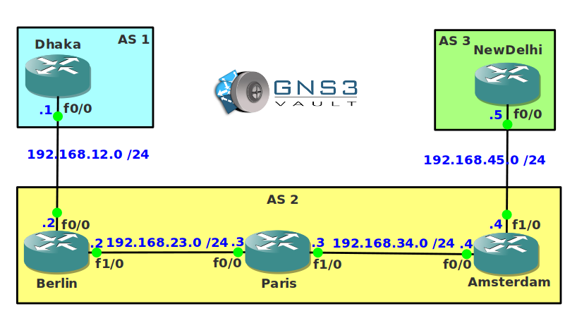

# BGP Troubleshooting

## Scenario

The fermentum corporation has hired you to troubleshoot their international network that consists of BGP routers. There are a number of issues. Some BGP routers are unable to establish a neighbor adjacency and others are having issues with prefixes not showing up in the routing tables. You have access to all devices so it's time to fix this network!

## Goal

* All IP addresses have been preconfigured for you.
* **Do not use show run**! (this will spoil the fun :) use the appropiate 'show' and 'debug' commands. This will teach you the skills needed to become a true troubleshooting master.
* The EBGP neighbor adjacency between router Dhaka and Berlin is not working, fix it!
* The EBGP neighbor adjacency between router NewDelhi and Amsterdam is not working, solve this issue!
* Router Berlin is supposed to receive the 11.11.0.0/16 prefix from router Dhaka but you don't see it in the BGP table, see if you can fix it.
* Router Amsterdam is not receiving any prefixes through BGP from within AS 2, get rid of this problem.
* Router Amsterdam is expecting the 5.5.5.0/24 prefix from router NewDelhi but you don't see it in it's BGP table.
* Router Amsterdam should now have 1.1.1.0/24 in its routing table, however if you try to ping it you cannot reach it...fix this.
* Whenever you send traffic from router Dhaka to NewDelhi nothing will arrive, make the required changes to fix this problem.

## IOS

c3640-jk9s-mz.124-16.bin

## Topology

