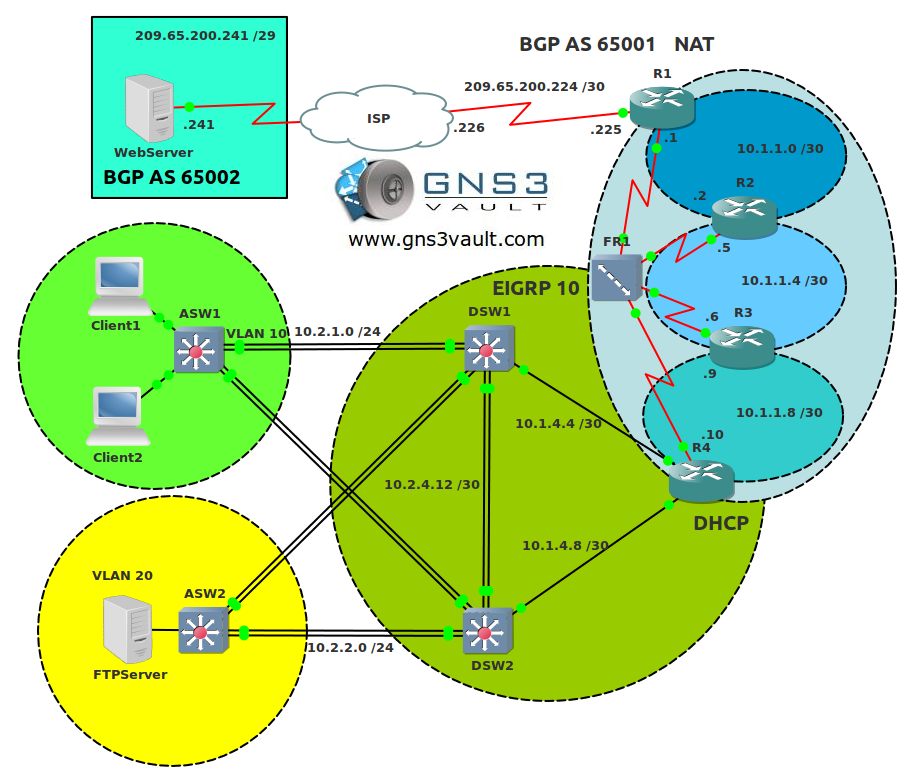

# CCNP TSHOOT Troubleshooting 1

## Scenario

This is the first CCNP TSHOOT Troubleshooting scenario based on the official Cisco CCNP TSHOOT topology. This lab is pre-configured and "broken" so you can learn how to troubleshoot a full network. Before you start with this lab I highly recommend you to study the topology, you can find the PDF in the attachments. Below you will find the troubleshooting tickets for you to solve!

## Goal

- Everything is pre-configured for you.
- **Do not use show run**! (this will spoil the fun :) use the appropriate 'show' and 'debug' commands. This will teach you the skills needed to become a true troubleshooting master.
- **Ticket #1:** One of the users was working on Client1 but he's complaining that there is no connectivity. He left a comment that he saw a message on the windows taskbar that said something like "no network connectivity". One of your colleagues looked into the problem and told you it had probably something to do with DHCP.
- **Ticket #2:** After fixing the issue with Client1 you receive another ticket that users from VLAN 10 are complaining that they are unable to connect to the FTP server.
- **Ticket #3:** Your users are happy that they can connect to the FTP server but they are still unable to reach the webserver.
- **Ticket #4:** The IPv6 team left a ticket for you that they are unable to reach 2026::12:/122 from DSW1 or DSW2.

## IOS

c3725-adventerprisek9-mz.124-12.bin

## Topology

