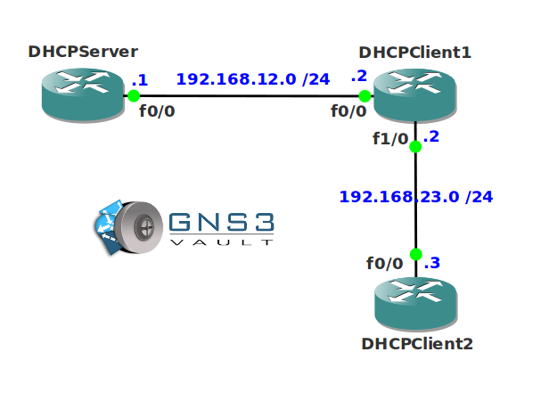

# DHCP Troubleshooting

## Scenario

As one of the network engineers of the network you are responsible for all DHCP related configurations. In this scenario there is one DHCP server that is configured to supply IP addresses for the 192.168.12.0/24 and 192.168.23.0/24 subnet. However both clients are not receiving any IP addresses...up to you to find a solution!

## Goal

* All required IP addresses have been preconfigured as specified in the topology picture.
* **Do not use show run**! (this will spoil the fun :) use the appropiate 'show' and 'debug' commands. This will teach you the skills needed to become a true troubleshooting master.
* Router DHCPClient1 needs to get an IP address through DHCP on its fa0/0 interface.
* Router DHCPClient2 needs to get an IP address through DHCP on its fa0/0 interface.
* Only router DHCPServer has to supply IP addresses.

## IOS

c3640-jk9s-mz.124-16.bin

## Topology

