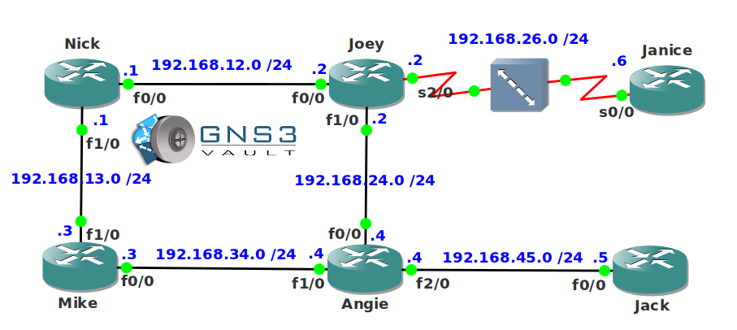

# EIGRP Neighbor Troubleshooting

## Scenario

Diamond corporation has hired you as an EIGRP expert to solve some of their routing problems. Recently the network was attacked and the hacker responsible changed the configurations of your routers so all EIGRP neighbor adjacencies are lost. It's up to you to troubleshoot these issues and make sure all EIGRP neighbor adjacencies are restored.

## Goal

- All IP addresses have been preconfigured for you.
- EIGRP is preconfigured with the AS numbers as specified in the topology picture.
- **Do not use show run**! (this will spoil the fun :) use the appropriate 'show' and 'debug' commands. This will teach you the skills needed to become a true troubleshooting master.
- Your goal is simple: Make sure all EIGRP neighbor adjacencies are working!

## IOS

```
c3640-jk9s-mz.124-16.bin
```

## Topology


