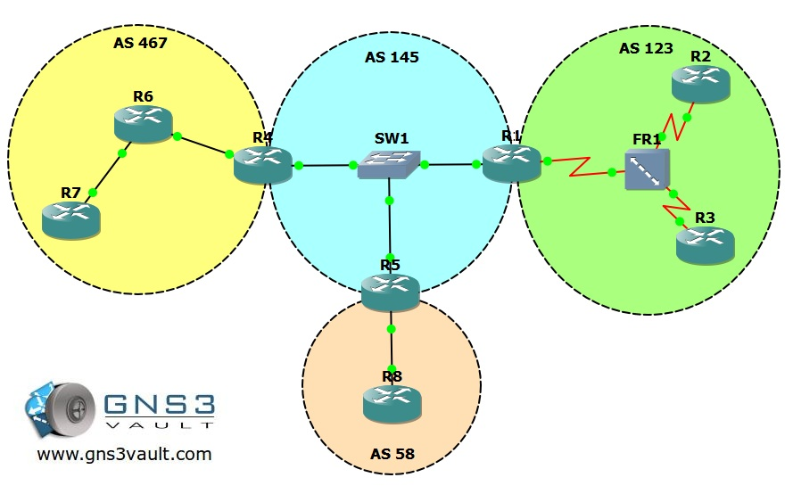

# EIGRP Troubleshooting

## Scenario

You are the senior network engineer for a global company and responsible for the routing of the network. You have worked very hard to improve the network, helpdesk calls have been brought back to a minimum and the network is at peak performance. Your boss wanted to reward you for your excellent input and pays for your holiday, meanwhile the other network engineers took over support. You just got back at the job after your excellent holiday and your mailbox has exploded with trouble tickets! Time to throw the flower necklace in the corner and get back to business!

## Goal

- All IP addresses have been preconfigured for you as following: 192.168.XY.X /24 where X = router1 and Y = router2. for example: 192.168.58.5 between router5 and router8.
- Every router has 1 or 2 loopback interfaces as following: Loopback0: x.x.x.x /24 for example: 1.1.1.1 for router1. Loopback1: xx.xx.xx.xx /24 for example: 11.11.11.11 for router1.
- EIGRP is preconfigured with the AS numbers as specified in the topology picture.
- **Do not use show run**! (this will spoil the fun :) use the appropiate 'show' and 'debug' commands. This will teach you the skills needed to become a true troubleshooting master.
- One of your colleagues created the frame-relay connection for a new branch office. The branch office is using R3 and the frame-relay switch configuration seems to be ok. No problems are reported between R1 and R2. Since the network engineer at the branch office is out of town you only have access to R1 to solve the problem.
- After solving the problem between R1 and R3 some of the users on the 3.3.3.0 network are complaining they are unable to connect to a server located on 2.2.2.0. You look on R1 and see the route in the routing table. You are unable to make changes at R2 or R3, but you are able to telnet into R2 from R1 and use the 'show ip route' command. The telnet password is 'branch2'.
- One of the junior network engineers added R5 recently to the network but for some reason the neighbor adjacency with R1 and R5 isn't working. R1 and R5 are working fine however. See if you can solve the problem.
- Somebody of the other routing-team decided to redistribute between the RIP network 44.44.44.0 and EIGRP on R4. When you look at R1 you don't see any entries though, you need to fix the problem on R4.
- After you fixed the redistribution on R4 you can see the 44.44.44.0 network in the routing table of R1. For some reason you still don't see it in R5, up to you to solve the problem.
- Yesterday night R6 crashed and was replaced by your overworked/stressed out colleague. There was no backup of the running-config so he created a new config. Users from the 4.4.4.0 network are complaining that they are unable to reach the 6.6.6.0 network. Your colleague is not here at the moment so you need to fix the problem.
- The network engineer from R7 also experienced problems with R6 and got impatient. He made some changes to R7 to solve the problem but now there's no connectivity at all with R6…he has no idea how to fix it so you need to help him out.
- One of the new trainees in the network team added a network command on R1 to advertise the 11.11.11.0 network. When you look on R2 or R3 you don't see this network in the routing table, you need to help him out. You are only allowed to make changes on R1.
- Some of the users are complaining in AS 467. Computers located in the 172.16.1.0 network are unable to communicate with the 172.16.2.0 network. You test if this is true by sending a ping from R6 towards the 172.16.1.0 network and using the loopback1 interface as the source and confirm the problem. See if you can fix it.
- Between R5 and R8 there should be an EIGRP neighbor adjacency but something seems to be wrong. The security team made some changes yesterday but they claim everything went ok.
- R8 has been configured to redistribute RIP into EIGRP AS58. However, for some reason you don't see the 88.88.88.0 network in the routing table in R5 which is also in AS58. R8 is an older router and you want to make sure it doesn't get overburdened by queries from R5 looking for lost prefixes.
- Users in AS145 are supposed to have access to a server located in network 88.88.88.0. Make the appropriate changes on R5 so this is possible.

## IOS

c3640-jk9s-mz.124-16.bin

## Topology

## Video Solution

[EIGRP Troubleshooting Video Solution](http://www.youtube.com/watch?v=opcGWpv5KYE)
