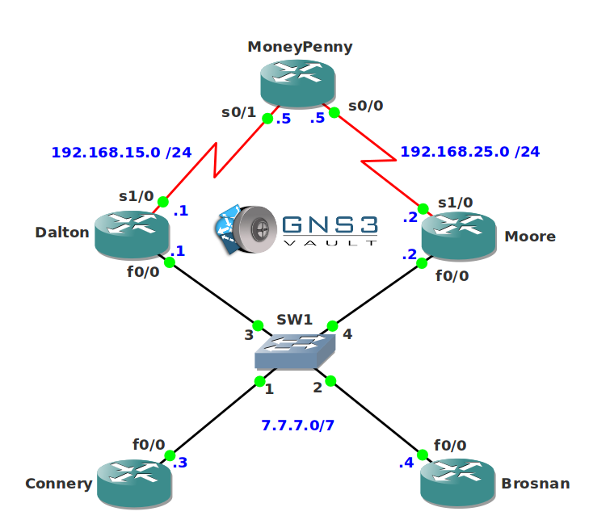

# GLBP Troubleshooting

## Scenario

The agency has acquired you as a special network engineer. Within the organization there is a network that is using GLBP as their FHRP (First Hop Routing Protocol). Recently the agency was hit by an EMP (Electromagnetic Pulse) attack and some of the bits on your routers have been flipped. As a result the GLBP configuration is messed up and agents Connery and Brosnan have trouble reaching router Moneypenny. Up to you to shake it up and fix GLBP!

## Goal

* All IP addresses have been preconfigured for you.
* **Do not use show run**! (this will spoil the fun :) use the appropriate 'show' and 'debug' commands. This will teach you the skills needed to become a true troubleshooting master.
* Router Dalton and Moore are configured for GLBP but there are issues.
* Make sure router Dalton and Moore are both configured for GLBP Virtual IP address 7.7.7.7 and that they can serve clients.

## IOS

c3640-jk9s-mz.124-16.bin

## Topology

