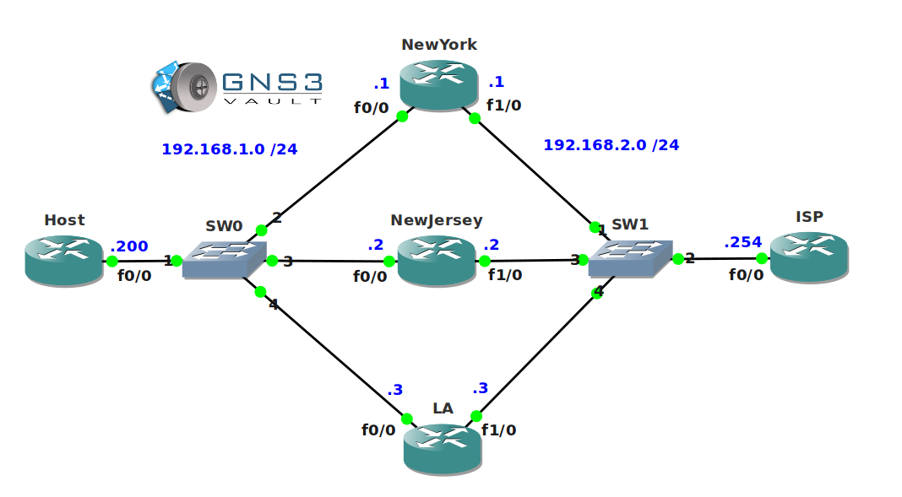

# HSRP Troubleshooting

## Scenario:

Hot Standby Routing Protocol is configured on an inter-city network and you are responsible for the configuration. While you were on vacation one of your colleagues tried to "tune" HSRP to make it failover faster. Unfortunately he totally messed up the configuration and he asks you to restore it back to normal. There are no backup configurations so you'll have to fix it yourself...time to put that martini aside and fix things!

## Goal:

- All IP addresses have been preconfigured for you.
- **Do not use show run**! (this will spoil the fun :) use the appropriate 'show' and 'debug' commands. This will teach you the skills needed to become a true troubleshooting master.
- Router NewYork, NewJersey and LA are configured for HSRP so router Host has a virtual gateway IP address.
- Fix HSRP so router NewYork, NewJersey and LA are in the same HSRP Group and form a single virtual gateway.
- Each HSRP router should be able to become the active router and forward IP packets from the host to the ISP.

## IOS:

c3640-jk9s-mz.124-16.bin

## Topology:
