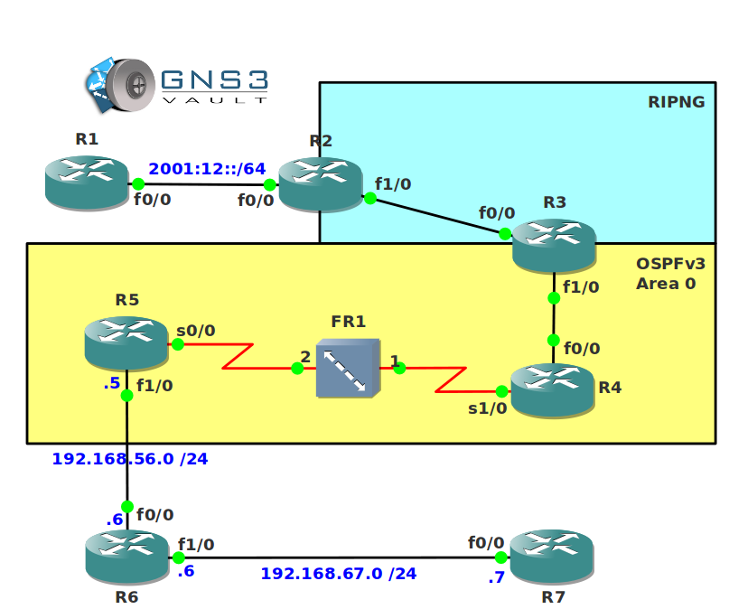

# IPv6 Troubleshooting

## Scenario

Your colleague Henry Exadecimal has been busy upgrading the network to IPv6 to replace the old IPv4 topology. Some of the routers have been configured for RIPNG, OSPFv3 and even some tunneling over IPv4. Unfortunately Henry isn't very good at IPv6 and the network is one big mess. You have been studying CCNP ROUTE for quite some time so you are very familiar with IPv6...it's up to you to fix this!

## Goal

* All IP addresses have been preconfigured for you.
* **Do not use show run**! (this will spoil the fun :) use the appropiate 'show' and 'debug' commands. This will teach you the skills needed to become a true troubleshooting master.
* R1 is supposed to receive an IPv6 prefix from R2 through autoconfiguration but for some reason this is not working.
* R1 should have an IPv6 default route in its routing table. You are not allowed to create a default route yourself or configure a routing protocol on R1.
* R3 should be able to reach the loopback0 interface of R2 but this is not working.
* R3 and R4 are configured for OSPFv3 but for some reason no neighbor adjacency is appearing.
* R2 should be able to reach the loopback0 interface of R4 and vice versa, however this is not working as expected.
* R4 and R5 are configured for OSPFv3 on the frame-relay link. The neighbor adjacency is not working however...
* R5 and R7 are configured for IPv6 6to4 tunneling because R6 is an IPv4-only device. For some reason the tunnel is not working.
* When you are finished, R2, R3, R4, R5 and R7 should be able to ping each others loopback0 interfaces.

## IOS

c3640-jk9s-mz.124-16.bin

## Topology

