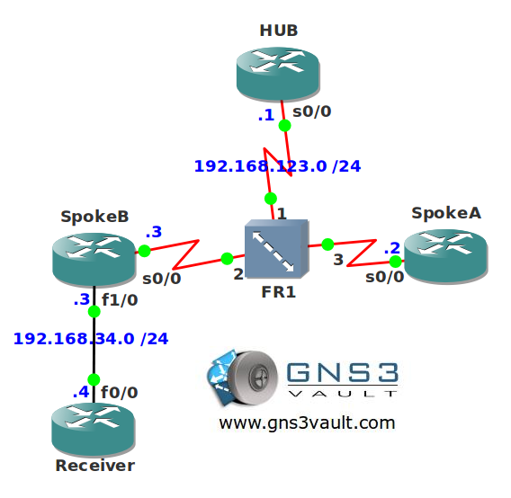

# Multicast RPF Failure NBMA Troubleshooting

## Scenario

You are responsible for the frame relay and multicast configuration within the network. You use a lot of hub and spoke topologies and up to now you haven't seen any problems. Yesterday one of your customers called claiming they are having some problems. There is a videostation behind one of the spoke routers streaming video using multicast. It seems one of the other spoke routers is unable to receive this stream...let's see what you can do.

## Goal

- All IP addresses have been preconfigured for you as specified in the topology picture.
- OSPF is preconfigured for full connectivity.
- **Do not use show run**! (this will spoil the fun :) use the appropiate 'show' and 'debug' commands. This will teach you the skills needed to become a true troubleshooting master.
- Start a ping on router SpokeA to IP address 224.9.9.9 to generate multicast traffic.
- Configure the network so router Receiver can receive this multicast traffic.
- You are not allowed to make any changes to the frame-relay network or change the PIM mode.

## IOS

c3640-jk9s-mz.124-16.bin

## Topology

## Video Solution

[Video: Multicast RPF Failure NBMA Troubleshooting](http://www.youtube.com/watch?v=KrXrh46Cqp4)
