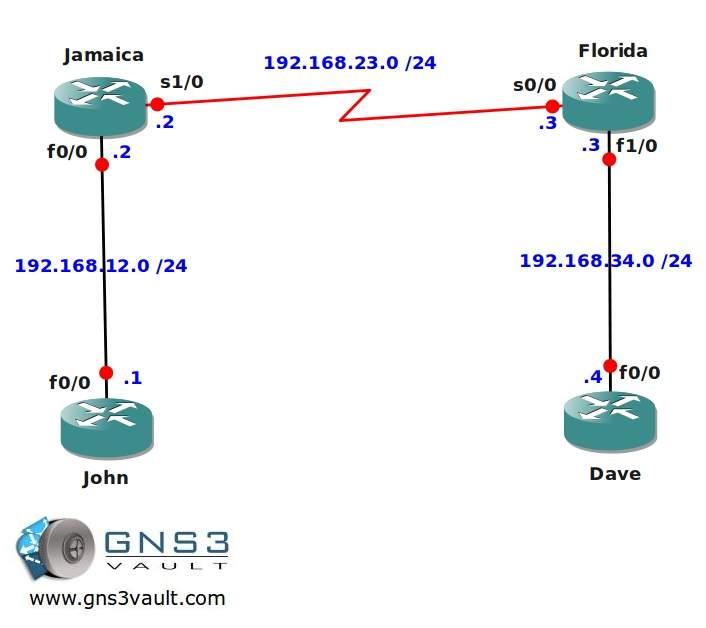

# NAT Dynamic Troubleshooting

## Scenario

Working for a company based in the caribbean isn't such a bad life. The sun is always shining and when there is no work you can relax at the beach. Today however you get a stress call from a junior network engineer who tried to replace a failed router. He claims to have configured NAT (network address translation) correctly but it's not working. Time for you to fix the problem!

## Goal

- All IP addresses have been preconfigured for you as following: 192.168.XY.X /24 where X = router1 and Y = router2. For example: 192.168.58.5 between router5 and router8.
- You are only allowed to make changes on router Jamaica.
- Your ISP has given you the 172.16.1.0/24 subnet to use for the NAT translation.
- **Do not use show run**! (this will spoil the fun :) use the appropriate 'show' and 'debug' commands. This will teach you the skills needed to become a true troubleshooting master.
- You need to make sure the 192.168.12.0 /24 subnet is translated into the IP addresses the ISP gave you when router John communicates with router Dave.

## IOS

c3640-jk9s-mz.124-16.bin

## Topology

## Video Solution

[Video Solution on YouTube](http://www.youtube.com/watch?v=THZ7git9wdk)
