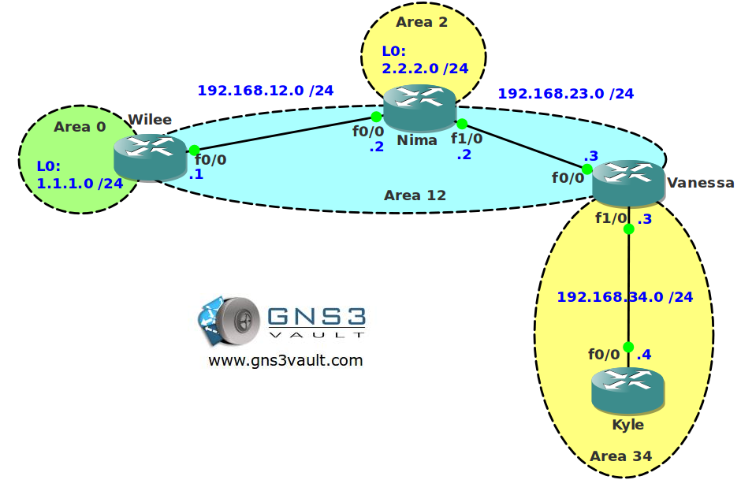

# OSPF Capability Transit Troubleshooting

## Scenario

After months of hard work, studying and doing labs you have the feeling you truly know how routing protocols work. Your boss decides to upgrade your salary and your title from Trainee to Junior network engineer and you will be responsible for daily maintenance for the network. Your senior network colleague (who is a true Guru but also very chaotic) is away for the the day and you are unable to reach him. Some users called you and complained about unreachable servers and slow links. It's 8:00am and they need to have access to the network by 12:00am. Time to show your boss who the new Guru is and perhaps get another salary upgrade!

## Goal

- All IP addresses have been preconfigured for you as specified in the topology picture.
- OSPF is preconfigured with the areas as specified in the topology picture.
- **Do not use show run**! (this will spoil the fun :) use the appropriate 'show' and 'debug' commands. This will teach you the skills needed to become a true troubleshooting master.
- Whenever router Nima tries to ping the FastEthernet0/0 interface of router Kyle traffic is being dropped. Solve the problem by using OSPF commands.

## IOS

c3640-jk9s-mz.124-16.bin

## Topology

