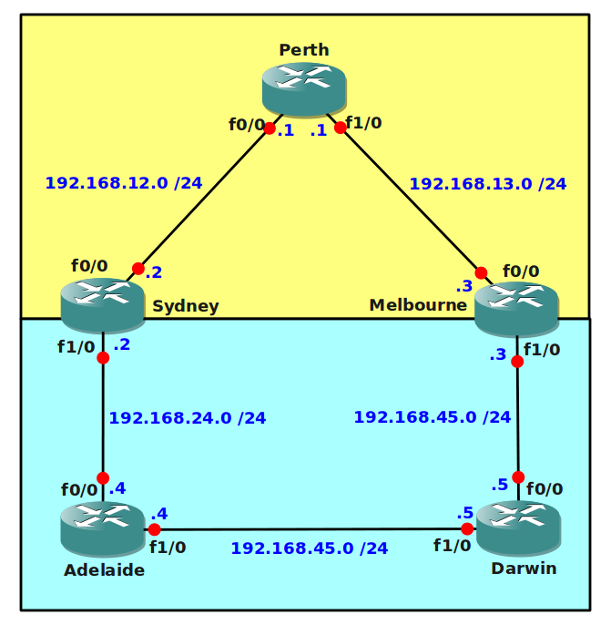

# OSPF RIP Redistribution AD Troubleshooting

## Scenario

Recently the australian government has decided that every major City should be interconnected. So far different states have used their own routing protocol and some of the older hardware is unable to run OSPF. Government workers have connected all routers and configured redistribution between RIP and OSPF so that every network is reachable. Everything seems to work fine and all routing tables have full information, however some people complained that the network is slow. You notice that when you start a traceroute from router Sydney or Melbourne towards the networks behind router Adelaide (4.4.4.4) or Darwin (5.5.5.5) that the traffic is sent towards router Perth. This is a classical example of sub-optimal routing...up to you to improve things!

## Goal

- All IP addresses have been preconfigured for you as following.
- Every router has 1 loopback interface as following: Loopback0: x.x.x.x /24 for example: 1.1.1.1 for router1.
- RIP and OSPF are preconfigured for you.
- **Do not use show run**! (this will spoil the fun :) use the appropiate 'show' and 'debug' commands. This will teach you the skills needed to become a true troubleshooting master.
- Do not make changes to the network commands in OSPF or RIP.
- You are not allowed to use distribute-lists, prefix-lists or route-maps.
- You are not allowed to change any of the redistribution commands.
- Ensure traffic takes the most optimal path to it's destination, use traceroute to check this.
- Ensure all routers have full connectivity, every network should be pingable using the most optimal path.

## IOS

c3640-jk9s-mz.124-16.bin

## Topology

## Video Solution

[Video: OSPF RIP AD Troubleshooting Solution](http://www.youtube.com/watch?v=gQ0amfpJrsI)
