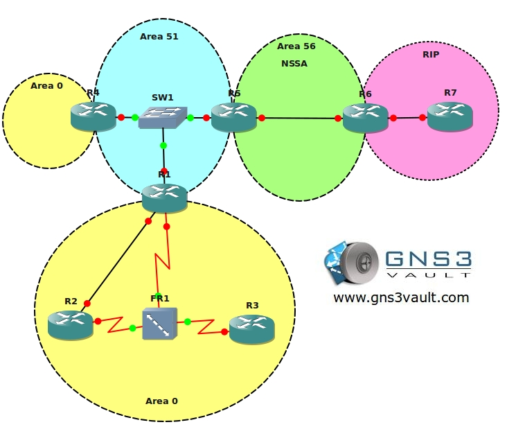

# OSPF Troubleshooting

## Scenario

After months of hard work, studying and doing labs you have the feeling you truly know how routing protocols work. Your boss decides to upgrade your salary and your title from Trainee to Junior network engineer and you will be responsible for daily maintenance for the network. Your senior network colleague (who is a true Guru but also very chaotic) is away for the the day and you are unable to reach him. Some users called you and complained about unreachable servers and slow links. It's 8:00am and they need to have access to the network by 12:00am. Time to show your boss who the new Guru is and perhaps get another salary upgrade!

## Goal

- All IP addresses have been preconfigured for you as following: `192.168.XY.X /24` where X = router1 and Y = router2. For example: `192.168.58.5` between router5 and router8.
- Every router has 1 or 2 loopback interfaces as following:
  - Loopback0: `x.x.x.x /24` for example: `1.1.1.1` for router1
  - Loopback1: `xx.xx.xx.xx /24` for example: `11.11.11.11` for router1
- OSPF is preconfigured with the areas as specified in the topology picture.
- **Do not use show run**! (this will spoil the fun :) use the appropriate 'show' and 'debug' commands. This will teach you the skills needed to become a true troubleshooting master.
- The network engineer responsible for the backbone area has some problems. R1 was replaced and the most recent config was unavailable so he used an older config. The OSPF adjacency between R1, R2 and R3 is not working now. You don't have access to R2 and R3.
- After fixing the problem on R1 you notice traffic from R1 towards R2 uses the fastethernet link. All traffic should be sent through the serial interface, when the frame-relay link fails it should switch to the fastethernet.
- Area 51 seems to have problems, you can't get any of the OSPF adjacencies up...make sure Area 51 has adjacencies between R1, R4 and R5.
- R4 is the most powerful router in Area 51, make sure it will become the DR.
- There used to be a link between R1 and R4 which failed...replacing the cable is impossible so you need to find another solution to fix the separated backbone.
- With Area 1 and 51 up and running everything should be ok. However when you look in the routing table of R1 you still don't see all of the networks. For example the `4.4.4.0` network is not available.
- RIP networks are configured to be redistributed into OSPF, however you don't see any of the `172.16.X.X` networks that are behind R7.
- The security officer made some changes in Area 56, the OSPF neighborship between R5 and R6 is not working anymore.
- For some reason R6 doesn't see any of the networks from the backbone area, see if you can find and solve the issue.
- R6 is configured to redistribute RIP into OSPF, however you don't see any of the networks coming from R7 in any of the OSPF routers.
- The network engineer of R6 has configured summarization of the RIP routes. However you still see 4 different `172.16.0.0 /24` networks. Configure the correct summary and make sure you don't advertise networks that you don't have.
- You notice that the `6.6.6.0` network is advertised in OSPF as a `/24`, make sure it's advertised as a `/32` without changing the subnet mask.
- The Redistributed routes in OSPF have the same cost, no matter which router you look at. Change this on R6 so the cost increases throughout the network.

## IOS

`c3640-jk9s-mz.124-16.bin`

## Topology

**You need to register to be able to download the GNS3 Topology File. (Registration is Free!)**

## Video Solution

[OSPF Troubleshooting Video Solution](http://www.youtube.com/watch?v=ONDZfivUn24)
