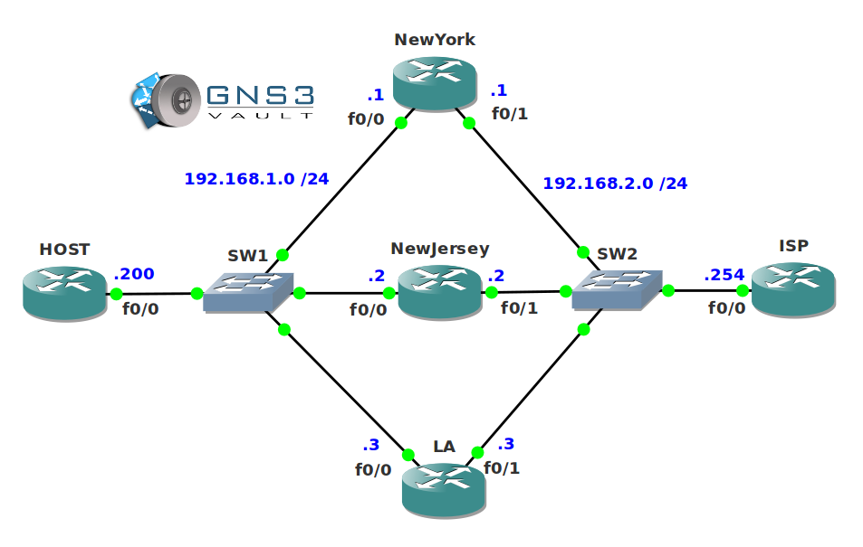

# VRRP Troubleshooting

## Scenario

VRRP (Virtual Router Redundancy Protocol) is used within your organization to make sure clients will always have a working default gateway. One of your routers was having issues and someone from the network trainees decided to change the VRRP configuration to solve this problem. He didn't exactly know what he was doing and he confessed he totally screwed up the VRRP configuration on all routers...up to you to show him who the router guru is and fix this problem!

## Goal

- All IP addresses have been preconfigured for you.
- **Do not use show run**! (this will spoil the fun :) use the appropriate 'show' and 'debug' commands. This will teach you the skills needed to become a true troubleshooting master.
- Router NewYork, NewJersey and LA should work together for VRRP group 1 to create a virtual gateway with IP address 192.168.1.254.
- Test each router as the Master VRRP router and see if traffic from the client can successfully be sent to the ISP router on the far side.
- Test each router to see if interface tracking is working successfully. If the Fa0/1 interface on router NewYork, NewJersey or LA goes down then another router should become VRRP Master.

## IOS

c3640-jk9s-mz.124-16.bin

## Topology

