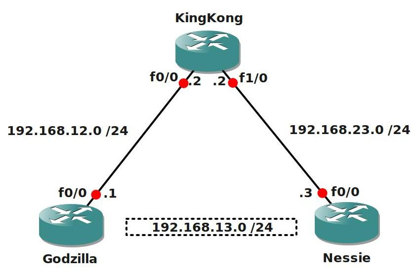

# GRE Tunnel Basic

## Scenario

You are working for Company "BigLabs" and you have heard some colleague network engineers talk about VPN tunnels and how they were unable to send routing protocols across the VPN tunnels. You also heard that a GRE tunnel could possible solve this problem. Let's see what this is all about and lab it up!

## Goal

- Configure all IP addresses as specified in the topology picture.
- Configure a loopback interface on Router Godzilla and Nessie:
  - Godzilla: Loopback0: 1.1.1.1 /24
  - Nessie: Loopback0: 3.3.3.3 /24
- Configure EIGRP AS1 on all 3 routers, only advertise the 192.168.12.0 and 192.168.23.0 network, do not advertise the loopbacks.
- Ensure Router Godzilla and Nessie can ping each other.
- Configure a GRE tunnel between Router Godzilla and Nessie.
- Configure the 192.168.13.0 /24 network on the GRE tunnel:
  - Godzilla: 192.168.13.1
  - Nessie: 192.168.13.3
- Ensure you can ping the IP addresses that you configured on the tunnel interface.
- Configure another loopback interface on Router Godzilla and Nessie:
  - Godzilla: Loopback1: 11.11.11.11 /24
  - Nessie: Loopback1: 33.33.33.33 /24
- Configure OSPF and use network commands to advertise the network on the GRE tunnel.
- Advertise Loopback1 in OSPF on Router Godzilla and Nessie.
- Ensure you establish a OSPF neighbor relationship and that you see the loopback1 interfaces in the routing table.

## IOS

c3640-jk9s-mz.124-16.bin

## Topology

## Video Solution

[Video Solution on YouTube](http://www.youtube.com/watch?v=TZ71eY0qpcY)
